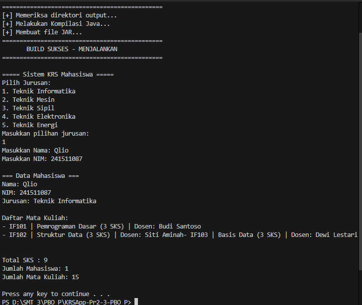

# Sistem KRS Mahasiswa (KRSApp) - Praktikum PBO 2 & 3

Repositori ini berisi source code aplikasi **Sistem Kartu Rencana Studi (KRS)** berbasis *Command Line Interface* (CLI).

Proyek ini dikembangkan sebagai tugas **Praktikum PBO Minggu ke-2 & 3** untuk mendemonstrasikan pemahaman konsep *Object Oriented Programming* (OOP) menggunakan bahasa Java.

## 📂 Fitur Utama

Aplikasi ini memiliki beberapa fitur utama untuk mensimulasikan pengisian KRS:
* **Pilihan Jurusan Dinamis**: Pengguna dapat memilih jurusan yang tersedia (Informatika, Mesin, Sipil, Elektro, Energi).
* **Input Data Mahasiswa**: Memasukkan Nama dan NIM secara interaktif.
* **Kalkulasi SKS Otomatis**: Menghitung total SKS berdasarkan daftar mata kuliah di jurusan yang dipilih.
* **Statistik**: Menampilkan jumlah total mahasiswa dan mata kuliah yang telah dibuat menggunakan *static keyword*.

## 🖼️ Dokumentasi & Screenshot

### 1. Tampilan Aplikasi
Berikut adalah tampilan saat program dijalankan:
> 
> *(Ganti `docs/screenshot-app.png` dengan screenshot program kamu jika nama filenya berbeda)*

### 2. Desain Class Diagram
Struktur kelas dan relasi antar objek dalam aplikasi ini:
> 

---

## 🛠️ Konsep OOP yang Diterapkan

Proyek ini menerapkan pilar-pilar OOP sebagai berikut:
1.  **Encapsulation**: Menggunakan *access modifier* `private` untuk atribut dan menyediakan `public getter` untuk akses data (Contoh: class `Mahasiswa`, `Jurusan`).
2.  **Association/Aggregation**:
    * `Mahasiswa` **memiliki** (has-a) `Jurusan`.
    * `Jurusan` **memiliki** daftar `MataKuliah`.
3.  **Static Members**: Menggunakan `static int` untuk menghitung jumlah total objek yang dibuat.

---

## 🚀 Cara Menjalankan (How to Run)

Kamu bisa menjalankan program ini dengan dua cara: **Otomatis** (menggunakan script) atau **Manual**.

### Opsi 1: Otomatis (Windows Only)
Cara termudah jika kamu menggunakan Windows. Script ini akan otomatis melakukan compile, packaging ke JAR, dan menjalankannya.

1.  Buka folder proyek di File Explorer.
2.  Klik dua kali file **`build.bat`**.
3.  Atau jalankan via terminal:
    ```bash
    .\build.bat
    ```

### Opsi 2: Compile & Run Manual (Terminal)
Gunakan cara ini jika kamu ingin memahami prosesnya atau menggunakan OS lain (Linux/Mac).

1.  **Buka Terminal** dan arahkan ke folder proyek ini.
2.  **Compile Source Code**:
    ```bash
    javac -d bin src/id/ac/polban/model/*.java src/id/ac/polban/service/*.java
    ```
3.  **Jalankan Program**:
    ```bash
    java -cp bin id.ac.polban.service.Main
    ```

### Opsi 3: Menjalankan File JAR
Jika kamu sudah berhasil melakukan *build* (Opsi 1), akan muncul file `KRSApp.jar`. Kamu bisa menjalankannya langsung:
```bash
java -jar KRSApp.jar

## 👤 Identitas Pengirim

- **Nama** : Qlio Amanda Febriany
- **NIM** : 241511087
- **Kelas** : 2C
- **Prodi** : D3 Teknik Informatika